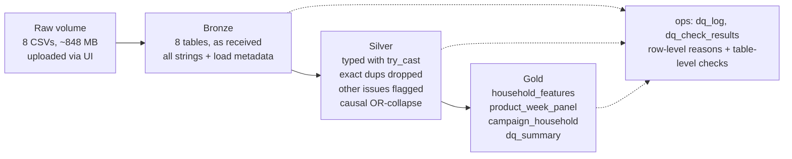

# Phase 1 plan: medallion pipeline

2026-10-09 · approved plan, exported from the working doc

Phase 1 turns the 8 raw dunnhumby CSVs into governed Delta tables in Unity Catalog (bronze → silver → gold), with every data-quality change logged, unit tests, and CI. Phases 2–5 read only from gold.



Data moves left to right; dashed lines show each layer writing its flags and check results to `ops`.

## Context and constraints

The design follows from four [Databricks Free Edition limits](https://docs.databricks.com/aws/en/getting-started/free-edition-limitations) and from the Phase 0 findings in [`data/README.md`](../data/README.md).

- **No internet from code.** Outbound access is restricted, so the CSVs are uploaded through the workspace UI into a volume. The [UI limit is 5 GB per file](https://docs.databricks.com/aws/en/ingestion/file-upload); the largest file is 696 MB.
- **Daily compute quota.** Going over it stops compute until the next day. Pipeline code is debugged locally first, so Databricks runs are few and clean.
- **Jobs:** at most 5 concurrent tasks. The pipeline runs as one sequential job, scheduled in Phase 5.
- **Serverless only, Python 3.12.3, Spark 4.2.0** (environment version 6). Local development uses the same versions. Spark 4's ANSI mode is on, so typing uses `try_cast`.
- **Data is static.** Every run is a full rebuild stamped with a `run_id`. A daily feed would switch silver to `MERGE`; the README will note how.

## Unity Catalog layout

One catalog with one schema per layer. The catalog name is a setting: `retail` if Free Edition allows creating a catalog, otherwise the default `workspace` catalog.

| Schema | Contents | Written by |
| --- | --- | --- |
| `raw` | volume `landing/` holding the 8 CSVs | you, via UI upload |
| `bronze` | 8 tables, raw as-is | `01_bronze` |
| `silver` | 8 tables, typed, deduplicated, flagged | `02_silver` |
| `gold` | `household_features`, `product_week_panel`, `campaign_household`, `dq_summary` | `03_gold` |
| `ops` | `dq_log` (row-level), `dq_check_results` (table-level), `pipeline_runs` | every step |

Tables are referenced as `catalog.schema.table`, e.g. `retail.silver.transactions`.

## Bronze: raw as-is

Bronze keeps exactly what was received, so any later number can be traced back to a raw row.

- Read each CSV with every column as a string, so nothing is converted silently.
- Rename columns to lower snake_case (the raw files mix `household_key` and `PRODUCT_ID`).
- Add `_source_file`, `_ingested_at` and `_run_id`.
- Check: bronze row counts equal the raw file line counts minus the header (e.g. 2,595,732 transaction lines, 36,786,524 causal rows).

## Silver: typed, deduplicated, flagged

Silver drops only exact duplicates; every other problem row is kept and flagged, and every affected row is written to `ops.dq_log` with a reason.

- **Typing** uses `try_cast`. A value that fails conversion becomes null and the row is flagged `cast_failed:<column>`.
- **Flags** live in a `dq_flags` array on each row, plus boolean columns for the common ones (`is_non_merchandise`, `has_demographics`).
- **`dq_log` columns:** `run_id`, `table_name`, `rule_id`, `action` (flagged / dropped / modified), `record_key` (JSON), `detail`, `logged_at`.

| Rule | Table | Rows (Phase 0) | Action |
| --- | --- | ---: | --- |
| Exact duplicate rows | coupon | 5,164 | drop, log |
| Conflicting duplicate keys | causal_data | 15,245 keys | OR-collapse, log both source rows |
| Fuel / non-merchandise department | transaction_data | 30,454 | flag `is_non_merchandise` |
| quantity = 0 | transaction_data | 14,466 | flag |
| sales_value = 0 | transaction_data | 18,850 | flag |
| quantity = 0 with sales_value > 0 | transaction_data | 67 | flag |
| retail_disc > 0 | transaction_data | 36 | flag |
| Same household, day, coupon under two campaigns | coupon_redempt | 14 pairs (28 rows) | flag |
| Blank department or category | product | 15 | flag, label `UNKNOWN` |
| Value fails type conversion | all | 0 expected | flag |

**OR-collapse rule (causal_data).** One row per product, store and week. `on_display` is true if any duplicate names a display location; `on_mailer` likewise. The kept `display_code` / `mailer_code` is the non-zero one, and the raw codes stay in `display_codes_raw` / `mailer_codes_raw`. In 99.3% of conflicts one row says `0` and the other names a location.

**Derived columns on silver transactions** (user-guide formulas):

- `shelf_price` = (sales_value − retail_disc − coupon_match_disc) / quantity
- `paid_price` = (sales_value + coupon_disc) / quantity (discounts are stored as negatives)
- `discount_depth` = −retail_disc / (sales_value − retail_disc), the loyalty discount as a share of shelf value
- `on_display`, `on_mailer` joined from causal_data. A missing row means not featured, the documented assumption.

## Gold: business-ready tables

Four gold tables, each built for one later phase.

| Table | Grain | Feeds | Main columns |
| --- | --- | --- | --- |
| `household_features` | household | Phase 3 | spend, baskets, frequency, recency, basket size, active weeks, stores used, department shares, private-label share, promo share, coupon use, demographics, `has_demographics` |
| `product_week_panel` | product × week | Phase 2 | units, sales, buying households, avg shelf price, avg discount depth, display share, mailer share |
| `campaign_household` | household × campaign | Phase 4 | campaign type and dates, `redeemed` label, redemption count, pre-campaign features |
| `dq_summary` | run × table × rule | Phase 5 dashboard | rows flagged / dropped / modified |

**One feature function, with a cutoff.** `household_features` comes from a function that takes an optional cutoff day. Phase 3 uses no cutoff. `campaign_household` calls it with cutoff = campaign start day, and a unit test checks that no input row is on or after that day.

**Product-week panel details.**

- Scope: merchandise lines only, the 115 stores with promotion data, weeks 9–101.
- Products: those bought in at least N of the 93 weeks (`panel_min_weeks`, set to 26). This is a judgment call, not a derived number: at 26 the panel keeps 12,997 products (85% of in-scope units, 77% of sales) and 43% of product-weeks have zero sales. Final choice and a sensitivity check (e.g. 13 and 52) are deferred to Phase 2.
- Weeks with no purchases are filled in with units = 0 and price left empty, so non-sales stay visible.
- **Display share** = sum over stores featuring the product that week of the store's traffic weight. A store's weight is its share of panel transaction lines in that week across the 115 stores. Mailer share is built the same way. A product featured only in stores these households rarely visit gets a small share.

## Data-quality checks

After each layer a checker writes pass/fail to `ops.dq_check_results`. An error-level failure stops the run; a warning is recorded and the run continues.

| Check | Layer | Severity |
| --- | --- | --- |
| Bronze rows = raw file lines | bronze | error |
| Silver rows + logged drops = bronze rows | silver | error |
| Keys unique: household (demographics), product, causal key after collapse, (household, campaign) | silver | error |
| Every product, household, campaign and coupon reference resolves | silver | error |
| display and mailer codes are in the documented lists | silver | error |
| `week_no = floor((day + 1) / 7) + 1` | silver | error |
| Redemptions fall inside their campaign window | silver | warning |
| Gold grain unique (one row per household / product-week / household-campaign) | gold | error |
| No pre-campaign feature uses data on or after the start day | gold | error |

Row flags (silver) say what is wrong with a record; checks say whether a whole table can be trusted.

## Code, tests and CI

All logic is in pure functions that take and return DataFrames; Delta reads and writes sit only in `io.py` and the notebooks, so tests run on local Spark without Delta.

```
src/retail_promo/   config.py  io.py  bronze.py  dq.py
                    silver/  (one module per table)
                    gold/    (household_features, product_week_panel, campaign_household, dq_summary)
                    run_local.py   dry run on the real CSVs, Parquet output
notebooks/          00_setup  01_bronze  02_silver  03_gold  04_dq_report
tests/              conftest.py (local Spark) + one test file per module, synthetic rows only
.github/workflows/ci.yml
```

- **Tests:** one per silver rule (e.g. a duplicate coupon row is dropped and logged), one per check, the OR-collapse cases, and the cutoff leakage test.
- **CI** (GitHub Actions): install uv and Java 17, then `uv sync --locked`, `ruff check`, `ruff format --check`, `pytest`. It runs once you push.
- **Notebooks** are `.py` source files that add `src/` to the path and call the functions, so the Databricks run and the local run share the same code.

## Order of work and done criteria

Build and verify locally first, then spend Databricks quota only on a run expected to pass.

1. **Claude, locally:** write `src/` and tests; dry-run on the real CSVs into `data/processed/` (gitignored); counts must match `data/README.md`.
2. **You:** create the GitHub repo `retail-promotions-analytics` and push; add it as a Git folder in Databricks; upload the 8 CSVs (about 848 MB) to the `landing/` volume.
3. **On Databricks:** run notebooks 00–04, compare counts with the local run, record the outcome in the README.

Done when:

- [ ] All bronze, silver, gold and ops tables exist in Unity Catalog
- [ ] Every error-level check passes; any warning is explained
- [ ] `dq_log` totals reconcile with bronze and silver row counts
- [ ] Tests pass locally and in CI

## Decisions taken

| Decision | Choice | Why |
| --- | --- | --- |
| Conflicting causal keys | OR-collapse (Option A) | 99.3% of conflicts are "none" vs a named location; the named location is the positive record |
| Panel grain | product × week, traffic-weighted store share | product × store × week is too sparse (~20 households per store) |
| Orchestration | plain notebooks calling `src/` | testable locally; `dq_log` keeps row-level reasons (Lakeflow expectations report counts only) |
| Load strategy | full rebuild per run | data is static |

Open: whether you already have a Free Edition account, and when you want commits (suggested: after the local dry run passes).
